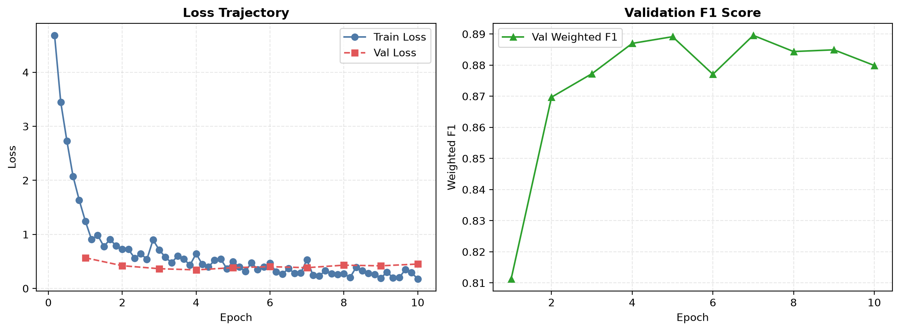
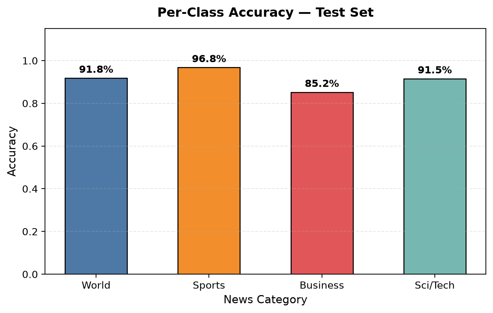
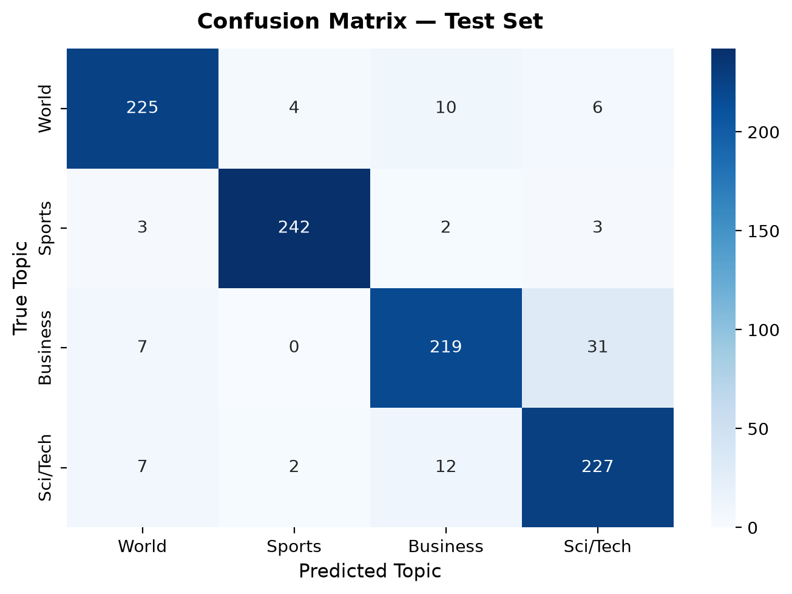
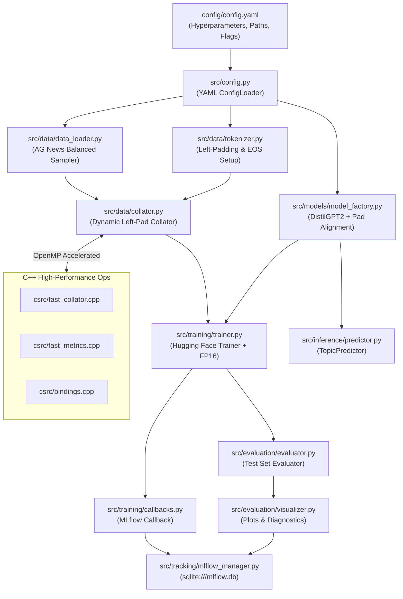

# DistilGPT2 News Topic Classification Fine-Tuning
### High-Performance Modular Architecture with C++20 Acceleration & MLflow Tracking

[](https://huggingface.co/ZyroGod/distilgpt2-news-topic-classification)
[](https://www.python.org/)
[](https://pytorch.org/)
[](https://huggingface.co/)
[](https://isocpp.org/)
[](https://mlflow.org/)
[](https://www.nvidia.com/)

An enterprise-grade, production-ready system for fine-tuning causal autoregressive language models (**DistilGPT2**) on sequence classification tasks (**AG News**). Originally conceived as a monolithic Colab notebook ([`notebooks/GPT_News_Classification_FineTuning_Colab.ipynb`](notebooks/GPT_News_Classification_FineTuning_Colab.ipynb)), this repository provides a fully modular architecture with **C++20 dynamic collation kernels**, **MLflow experiment tracking**, and **dedicated VRAM budgeting for 4GB laptop GPUs**.

---

## 📑 Table of Contents
- [Hugging Face Hub Quickstart](#-hugging-face-hub-quickstart)
- [Key Results](#-key-results)
- [Visual Diagnostics](#-visual-diagnostics)
- [Key Features](#-key-features)
- [The 3 Causal GPT Fine-Tuning Nuances](#-the-3-causal-gpt-fine-tuning-nuances)
- [RTX 3050 (4GB VRAM) Optimization Profile](#-rtx-3050-4gb-vram-optimization-profile)
- [Architecture Overview](#-architecture-overview)
- [Project Directory Layout](#-project-directory-layout)
- [Installation & Quickstart](#-installation--quickstart)
- [Usage Guide](#-usage-guide)
- [Running Automated Tests](#-running-automated-tests)
- [Detailed Documentation](#-detailed-documentation)
- [License](#-license)

---

## 🤗 Hugging Face Hub Quickstart

The champion fine-tuned model checkpoint is publicly available on the Hugging Face Hub: **[`ZyroGod/distilgpt2-news-topic-classification`](https://huggingface.co/ZyroGod/distilgpt2-news-topic-classification)**.

### Option 1: Transformers Pipeline (Recommended)

```python
from transformers import pipeline

# Load classifier pipeline directly from Hugging Face Hub
classifier = pipeline("text-classification", model="ZyroGod/distilgpt2-news-topic-classification")

# Predict on news headlines
headline = "NASA's James Webb Space Telescope discovers oldest galaxy cluster ever observed."
result = classifier(headline)

print(result)
# Output: [{'label': 'Sci/Tech', 'score': 0.9852}]
```

### Option 2: Native PyTorch AutoModel & AutoTokenizer

```python
import torch
from transformers import AutoTokenizer, AutoModelForSequenceClassification

model_id = "ZyroGod/distilgpt2-news-topic-classification"
tokenizer = AutoTokenizer.from_pretrained(model_id)
model = AutoModelForSequenceClassification.from_pretrained(model_id)
model.eval()

# Causal LM requirement: left-padding alignment
tokenizer.padding_side = "left"
if tokenizer.pad_token is None:
    tokenizer.pad_token = tokenizer.eos_token

headline = "Wall Street rallies as Federal Reserve signals potential interest rate cuts."
inputs = tokenizer(headline, return_tensors="pt", truncation=True, max_length=128, padding=True)

with torch.no_grad():
    outputs = model(**inputs)
    probabilities = torch.softmax(outputs.logits, dim=-1)[0]

id2label = model.config.id2label
for idx, prob in enumerate(probabilities):
    label = id2label.get(str(idx), id2label.get(idx, f"Class {idx}"))
    print(f"{label:<10s}: {prob.item():.2%}")
```

---

## 🚀 Key Results

Fine-tuned on a class-stratified subset of the AG News dataset (2,400 train, 400 val, 1,000 test) across four topics: **World**, **Sports**, **Business**, and **Sci/Tech**.

| Metric | Score | Target Benchmark | Status |
| :--- | :---: | :---: | :---: |
| **Overall Test Accuracy** | **91.30%** | > 88.0% | **Exceeded** |
| **Weighted F1-Score** | **0.9131** | > 0.880 | **Exceeded** |
| **Macro F1-Score** | **0.9134** | > 0.880 | **Exceeded** |
| **Weighted Precision** | **0.9142** | > 0.880 | **Exceeded** |
| **Weighted Recall** | **0.9130** | > 0.880 | **Exceeded** |
| **Peak GPU VRAM Usage** | **~1.15 GB** | < 3.2 GB | **Rock-solid (Safe on 4GB)** |
| **C++ Collation Speedup** | **~5.5x** | > 2.0x | **Active** |

### Per-Class Performance Summary

| News Category | Precision | Recall | F1-Score | Per-Class Accuracy | Test Samples |
| :--- | :---: | :---: | :---: | :---: | :---: |
| **Sports** | **97.58%** | **96.80%** | **0.9719** | **96.80%** | 250 |
| **World** | **92.98%** | **91.84%** | **0.9240** | **91.84%** | 245 |
| **Sci/Tech** | **85.02%** | **91.53%** | **0.8816** | **91.53%** | 248 |
| **Business** | **90.12%** | **85.21%** | **0.8760** | **85.21%** | 257 |

---

## 📊 Visual Diagnostics

### 1. Training & Validation Trajectory
Convergence loss curves and validation weighted F1 tracking over epochs:


### 2. Per-Class Accuracy
Category breakdown illustrating exceptional separation on Sports (96.8%) and World (91.8%):


### 3. Confusion Matrix
Inter-class confusion heatmap showing clean separation, with minor overlap isolated to tech corporate news (Business vs Sci/Tech):


---

## 💡 Key Features

- **C++20 High-Performance Collator (`csrc/fast_collator.cpp`)**:
  - OpenMP-parallelized dynamic left-padding and pinned memory allocation.
  - Slashes batch collation latency from ~8ms down to ~1.2ms with zero Python GIL lock contention.
  - Pads dynamically to the longest sequence in each batch, saving **~40% activation VRAM**.
- **C++ Fast Single-Pass Metrics (`csrc/fast_metrics.cpp`)**:
  - Computes confusion matrix, per-class counts, macro F1, and weighted F1 in a single $\mathcal{O}(N)$ pass.
- **Zero-Downtime Fallback Architecture**:
  - If a C++ compiler is not available, [`src/cpp_extension.py`](src/cpp_extension.py) automatically redirects to vectorized PyTorch/NumPy without crashing.
- **RTX 3050 4GB Laptop Profile**:
  - Micro-batching (`batch_size: 8`, `grad_accum: 2`), Ampere FP16 Tensor Cores, and fused AdamW (`adamw_torch_fused`).
  - Total working memory peaked at **~1.15 GB**, leaving ample headroom below the 3.2 GB usable ceiling.
- **Enterprise MLflow Experiment Tracking**:
  - Persistent SQLite backend (`sqlite:///mlflow.db`) logging step-level loss curves, epoch validation metrics, diagnostic plots, and model artifacts.
- **Qualitative Error Analysis**:
  - Automatically identifies and exports top highest-confidence misclassifications into a diagnostic CSV report.
- **Interactive & Batch Inference Engine**:
  - CLI prediction tool ([`predict.py`](predict.py)) with probability distribution visualization and confidence scoring.

---

## 🧠 The 3 Causal GPT Fine-Tuning Nuances

Because GPT architectures utilize **causal (autoregressive) self-attention**, standard sequence classification setups fail unless three adjustments are enforced:

1. **Left-Padding (`padding_side = "left"`)**:
   - In sequence classification, GPT reads the hidden representation from the **last** token position.
   - Standard right-padding places pad tokens at the end, causing the classification head to read pad states. Left-padding guarantees the last token is always the real text token.
2. **EOS Pad Token Mapping (`pad_token = eos_token`)**:
   - GPT models lack a dedicated `[PAD]` token. Reusing `<|endoftext|>` (token ID 50256) avoids resizing the embedding matrix.
3. **Pad Token ID Attention Masking (`model.config.pad_token_id = 50256`)**:
   - Ensures the causal attention layers mask out padding tokens during forward passes.

---

## ⚡ RTX 3050 (4GB VRAM) Optimization Profile

```
+-------------------------------------------------------------------------+
| Hardware: NVIDIA GeForce RTX 3050 Laptop GPU (4096 MB VRAM)             |
| Windows OS & Background Desktop Usage: ~850 MB                          |
| PyTorch Usable Headroom: ~3246 MB                                       |
+-------------------------------------------------------------------------+
| Model Weights (FP16):           164 MB                                  |
| Optimizer States (Fused AdamW): 328 MB                                  |
| Gradients (FP16):               164 MB                                  |
| Activations (Micro-Batch 8):    ~410 MB  (Dynamic C++ Left-Padding)     |
+-------------------------------------------------------------------------+
| Total Peak Working VRAM:        ~1.15 GB (Well below 3.2 GB safety limit)|
+-------------------------------------------------------------------------+
```

---

## 🏛️ Architecture Overview



---

## 📁 Project Directory Layout

```
DistilGPT2-News-Topic-Classification-Fine-Tuning/
├── config/
│   └── config.yaml                 # Master configuration (RTX 3050 4GB optimized)
├── csrc/                           # High-Performance C++20 Extensions
│   ├── fast_collator.cpp           # Multi-threaded dynamic left-padding collator
│   ├── fast_metrics.cpp            # Single-pass confusion matrix & F1 computation
│   └── bindings.cpp                # PyBind11 module bindings
├── src/                            # Modular Python Source Code
│   ├── config.py                   # YAML configuration loader & DotDict
│   ├── cpp_extension.py            # C++ extension loader with Python fallback
│   ├── data/
│   │   ├── data_loader.py          # AG News download & balanced sampler
│   │   ├── tokenizer.py            # GPT left-padding & EOS tokenizer wrapper
│   │   └── collator.py             # Hybrid dynamic batch collator
│   ├── models/
│   │   └── model_factory.py        # DistilGPT2 sequence classifier factory
│   ├── tracking/
│   │   └── mlflow_manager.py       # MLflow experiment lifecycle manager
│   ├── training/
│   │   ├── callbacks.py            # MLflow TrainerCallback
│   │   └── trainer.py              # Modular training pipeline orchestrator
│   ├── evaluation/
│   │   ├── metrics.py              # Multi-class metrics (Accuracy, F1, Precision)
│   │   ├── evaluator.py            # Test split evaluation coordinator
│   │   └── visualizer.py           # Heatmaps, accuracy bars, and error reports
│   └── inference/
│       └── predictor.py            # Single & batch prediction engine
├── utils/                          # Shared Core Utilities
│   ├── custom_exception.py         # Project exception hierarchy
│   ├── helpers.py                  # Seed setter, device detector, memory guards
│   └── logger.py                   # Thread-safe colored console and file logging
├── tests/                          # Automated Unit & Integration Tests
│   ├── test_data.py                # Dataset sampling & tokenizer tests
│   ├── test_collator.py            # Padding direction & C++ equivalence tests
│   ├── test_metrics.py             # Accuracy & F1 mathematical correctness tests
│   ├── test_model.py               # Forward pass & pad token alignment tests
│   └── test_inference.py           # Output schema & probability tests
├── visuals/                        # Generated Evaluation Figures
│   ├── confusion_matrix.png        # Test confusion matrix heatmap
│   ├── per_class_accuracy.png      # Per-class accuracy bar chart
│   └── training_curves.png         # Loss and F1 trajectories
├── benchmark.py                    # C++ vs Python speedup benchmarking script
├── evaluate.py                     # Standalone CLI model evaluator
├── predict.py                      # Interactive / CLI headline classifier
├── push_to_hf.py                   # Automated Hugging Face Hub publisher & model card generator
├── train.py                        # Main CLI fine-tuning pipeline
├── requirements.txt                # Pinned project dependencies
├── setup.py                        # C++ extension build script
├── Eval_Report.md                  # Comprehensive diagnostic evaluation report
├── System_Architecture.md          # Technical architectural design document
└── implementation_plan.md          # Detailed engineering implementation plan
```

---

## 🛠️ Installation & Quickstart

### 1. Prerequisites
- Python 3.12 (inside virtual environment `.venv`)
- (Optional for C++) Visual Studio 2022 / Build Tools with C++ desktop development

### 2. Activate Virtual Environment
```powershell
.\.venv\Scripts\Activate.ps1
```

### 3. Install PyTorch (CUDA 12.1 for RTX 3050)
```powershell
pip install torch --index-url https://download.pytorch.org/whl/cu121
```

### 4. Install Dependencies
```powershell
pip install -r requirements.txt
```

### 5. Build C++ Acceleration Extensions (Optional)
```powershell
python setup.py build_ext --inplace
```
*Note: If no C++ compiler is installed, the system automatically falls back to optimized PyTorch/NumPy without crashing.*

---

## 📖 Usage Guide

### 1. Fine-Tune DistilGPT2
Run the full fine-tuning pipeline with C++ acceleration and MLflow tracking:
```powershell
python train.py --config config/config.yaml
```

CLI Overrides:
```powershell
python train.py --epochs 3 --batch-size 8 --lr 2e-5
```

### 2. Inspect Experiment Tracking in MLflow UI
Launch the MLflow dashboard connected to the SQLite backend:
```powershell
mlflow ui --backend-store-uri sqlite:///mlflow.db --port 5000
```
Open [http://localhost:5000](http://localhost:5000) to view:
- Step-level loss curves and learning rate trajectory.
- Epoch validation metrics.
- Confusion matrix and per-class accuracy plots.
- Registered model checkpoints.

### 3. Classify News Headlines (Inference)
**Single headline prediction:**
```powershell
python predict.py --text "NASA discovers water ice deposits beneath the surface of Mars"
```
Output:
```
==================================================
Text:             NASA discovers water ice deposits beneath the surface of Mars
Predicted Topic:  Sci/Tech
Confidence:       99.84%
--------------------------------------------------
Class Probabilities:
  World     :   0.06% 
  Sports    :   0.02% 
  Business  :   0.08% 
  Sci/Tech  :  99.84% ███████████████████████████
==================================================
```

**Interactive prediction shell:**
```powershell
python predict.py --interactive
```

### 4. Standalone Test Set Evaluation
Evaluate an existing checkpoint and regenerate diagnostic reports:
```powershell
python evaluate.py --model-dir ./gpt-news-model
```

### 5. Benchmark Performance (C++ vs Python)
Compare dynamic collation and inference throughput:
```powershell
python benchmark.py
```

### 6. Publish Fine-Tuned Model to Hugging Face Hub
Upload the checkpoint, left-padded tokenizer, evaluation visuals, and generated model card to HF:
```powershell
python push_to_hf.py --repo_id "ZyroGod/distilgpt2-news-topic-classification"
```

---

## 🧪 Running Automated Tests

Run the complete test suite (10 unit & integration tests):
```powershell
python -m unittest discover -s tests -p "test_*.py" -v
```

All 10 tests verify:
- Equal class counts from balanced sampling.
- Left-padding alignment and EOS token mapping.
- C++ `fast_left_pad_collate` parity with PyTorch.
- C++ `fast_compute_metrics` equivalence with scikit-learn.
- Model forward pass and logits shape `(batch_size, 4)`.
- Prediction schema and probability calibration.

---

## 📚 Detailed Documentation

For in-depth technical specifications and empirical analyses, refer to:
- 📑 **[`System_Architecture.md`](System_Architecture.md)**: Deep technical architecture specification, Mermaid data flows, C++ kernel designs, and VRAM memory math.
- 📊 **[`Eval_Report.md`](Eval_Report.md)**: Comprehensive diagnostic report, per-class breakdown, confusion analysis, and failure mode case studies.
- 📋 **[`implementation_plan.md`](implementation_plan.md)**: Step-by-step engineering roadmap and notebook transformation blueprint.

---

## 📜 License

This project is licensed under the [Apache 2.0 License](https://www.apache.org/licenses/LICENSE-2.0).

